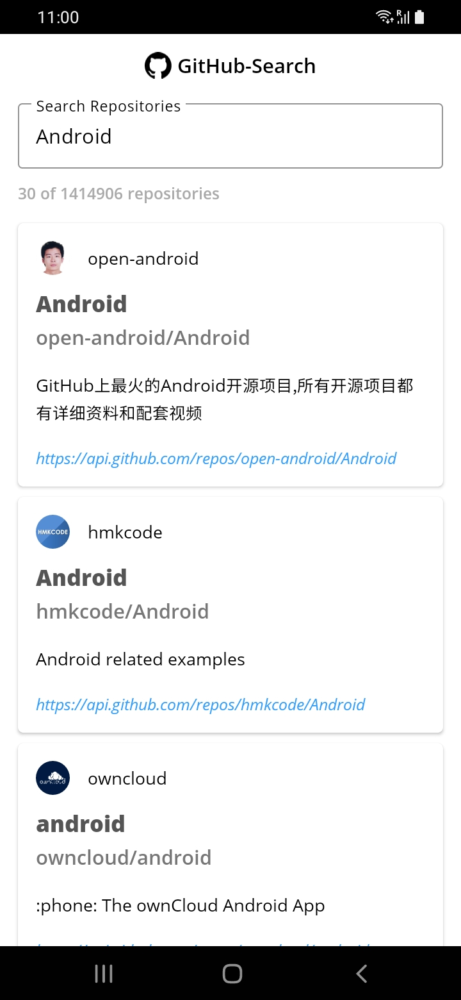

# GitHub-Search

A simple application to search and list repositories using [GitHub API](https://docs.github.com/en/rest?apiVersion=2022-11-28).

Features include:
- One screen with a search field and a list of repositories
- Search request results contain 30 items and supports pagination
- The application supports phone and tablet
- The application supports portrait and landscape layout
- Tech stack: MVVM, Kotlin, Coroutines, Retrofit, Hilt, Min SDK 23 
- The app is obfuscated with R8

## Screenshot

  

